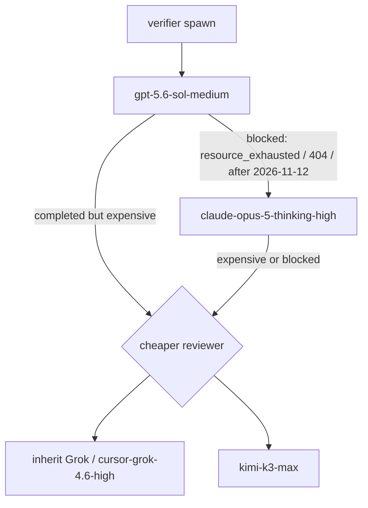

# Harness: Cursor (Grok parent + Composer implementer)

> Status: **live**. Roles: [`../`](../). Executable defs: [`.cursor/agents/`](../../../.cursor/agents/).
> Isolation is **opt-in**. Local subagents share the parent checkout unless you ask for a worktree or `/in-cloud`.

## When to use

- Human is in Cursor Agent (this repo’s default while Cline free quota is exhausted).
- Parent model: **Grok 4.6** (orchestrator + leader; planner inherits unless you skip the child).
- Implementer model: **Composer 2.5**.

Do not recreate three Herdr panes. Cursor has no wait/prompt protocol between named long-lived workers.

## Topology mapping

| Role         | This harness                             | Notes                                                                                                                                               |
| ------------ | ---------------------------------------- | --------------------------------------------------------------------------------------------------------------------------------------------------- |
| orchestrator | parent Agent chat (Grok 4.6)             | only human-facing session                                                                                                                           |
| leader       | **folded into the parent**               | same duties + LOG as `../leader.md`                                                                                                                 |
| planner      | subagent `.cursor/agents/planner.md`     | `model: inherit` (Grok). PLAN.md/LOG.md only — not `readonly` because Part A writes PLAN.md                                                         |
| developer    | subagent `.cursor/agents/implementer.md` | `model: composer-2.5` · **own worktree**                                                                                                            |
| verifier     | subagent `.cursor/agents/verifier.md`    | `readonly: true`, `model: gpt-5.6-sol-medium` — run after `PR-DRAFT`. Covers planner Part B. Do not also spawn planner review unless verifier asks. |

Small phases may skip spawning planner and refine PLAN.md in the parent. Still write `PLAN-READY` into LOG.md.

### Alternate (two pinned chats)

Agents Window: Chat A = Grok (plan/ask), Chat B = Composer + `/worktree`. The **human** is the bus. Use this when you want to watch implementation without Task-tool folding. Same role contracts.

## Isolation

| Mode                   | Use                                                                             |
| ---------------------- | ------------------------------------------------------------------------------- |
| Shared parent checkout | verifier (readonly); planner may share because it only writes PLAN.md/LOG.md    |
| Git worktree           | implementer on product code (`/worktree`, Agents Window, or `agent --worktree`) |
| `/in-cloud`            | long implementer runs; own VM + branch. Cloud MCP ≠ local `.cursor/mcp.json`    |
| `/best-of-n`           | competing implementations, **not** a role team                                  |
| `/multitask`           | only when file sets do not overlap                                              |

Never two write-capable agents on the same checkout.

## Model pinning

| Role                  | Pin                                                                         | Rationale                                                                                                                                                                                                                                 |
| --------------------- | --------------------------------------------------------------------------- | ----------------------------------------------------------------------------------------------------------------------------------------------------------------------------------------------------------------------------------------- |
| orchestrator / leader | Grok 4.6 in the parent picker                                               | long tool loops, instruction following                                                                                                                                                                                                    |
| planner               | `inherit`                                                                   | same judgment as parent                                                                                                                                                                                                                   |
| developer             | `composer-2.5` (`composer-2.5-fast` if the Fast variant is the picker name) | edits + terminal                                                                                                                                                                                                                          |
| verifier              | `gpt-5.6-sol-medium`                                                        | Default review. Blocked → Opus 5. Expensive → Grok then Kimi K3. OpenAI shutoff 2026-11-12. |

On **legacy request-based plans without Max Mode**, Cursor may ignore `model:` and run subagents as Composer. If that happens, run planner/verifier in the parent Grok chat instead of Task, and LOG the fallback.

If Grok quota is exhausted: keep this harness, switch the **parent** picker to whatever reasoning model is available, and LOG it. Do not silently start Cline panes from a Cursor session.

## OpenAI / GPT window and usage

- Default review model: `gpt-5.6-sol-medium`. Proposed OpenAI Cursor shutoff **2026-11-12** ([OpenAI](https://openai.com/index/our-decision-on-cursor-following-its-acquisition-by-spacex/)).
- After **every** review spawn, append to `.tasks/phase-N-*/LOG.md`: model slug, start/end, `usage` (UI cost or `not visible`), verdict.
- Fallback (do not ask the human first — this is the pin):



- **Blocked** = spawn error, quota, or shutoff. Next try is Opus 5.
- **Expensive** = the human or a huge usage delta vs a Grok pass. Next try is Grok, then Kimi K3. LOG the substitution.
- `.cursor/agents/verifier.md` `model:` stays Sol. Parent Task overrides `model` on fallback.

## Spawn sequence (per phase)

1. Parent (Grok) reads SPEC + PLAN + this file. Creates or updates `.tasks/phase-N-*/LOG.md` (leader duties).
2. `Use the planner subagent` (or `/planner`) with the Part A brief. Wait for `PLAN-READY`. Human may still be asked to approve PLAN deltas. Planner is **not** `readonly` (it writes PLAN.md); treat product-code edits as a bug.
3. After PLAN-READY: `Run the implementer subagent on Composer in its own worktree` with the developer brief (`../developer.md`). Isolation phrase is mandatory. Implementer must open `--draft` and stop at `PR-DRAFT`.
4. On `PR-DRAFT`: `/verifier` on **GPT 5.6 Sol medium**. If spawn is blocked, retry Opus 5 (`claude-opus-5-thinking-high`). If a review is expensive, next ones use Grok then Kimi K3. Record usage in LOG. Do not mark the PR ready yet.
5. On `REVIEW APPROVE`: implementer (or parent) runs `gh pr ready`, then `PR-READY`.
6. Parent records ready + asks the **human to merge**. Do not `gh pr merge` unless the human explicitly asked for that phase (Phase 0 was that exception).

Parent prompt (copy):

```text
Harness: cursor. Fold leader into this chat.
Use the planner subagent first (PLAN.md only). After PLAN-READY and human ack,
run the implementer subagent on Composer in its own worktree.
Implementer opens a draft PR (PR-DRAFT). Then run verifier on GPT 5.6 Sol medium
(Opus 5 if Sol is blocked; Grok then Kimi K3 if a review is expensive).
After REVIEW APPROVE, gh pr ready. Do not merge. Do not implement product code in this chat.
```

Invoke explicitly with `/planner`, `/implementer`, `/verifier` when automatic delegation picks the wrong child.

## MCP / skills

Project MCP: [`.cursor/mcp.json`](../../../.cursor/mcp.json) — Astro Docs at `https://mcp.docs.astro.build/mcp`.

Parent and **local** subagents inherit it. Cloud children do not; register the same URL as a Team MCP if implementer is `/in-cloud`.

## Failure handling

- Approval / destructive: parent asks the human (Cursor Run Mode). Never tell implementer to `--force` git or skip hooks.
- Stall: Stop, or resume the child by agent ID (`Resume agent <id> …`).
- Implementer dirty-tree conflict: stop, move to a worktree, do not rebase the human’s checkout.
- Nested spawn: main + direct children only (no grandchild Task). If implementer needs search, it uses built-in Explore — it must not spawn another implementer.

## Do not

- Pin muse-spark / glm-5.3-flash in this file.
- Treat `/best-of-n` as leader/planner/developer.
- Assume cloud children see local MCP or Herdr.
