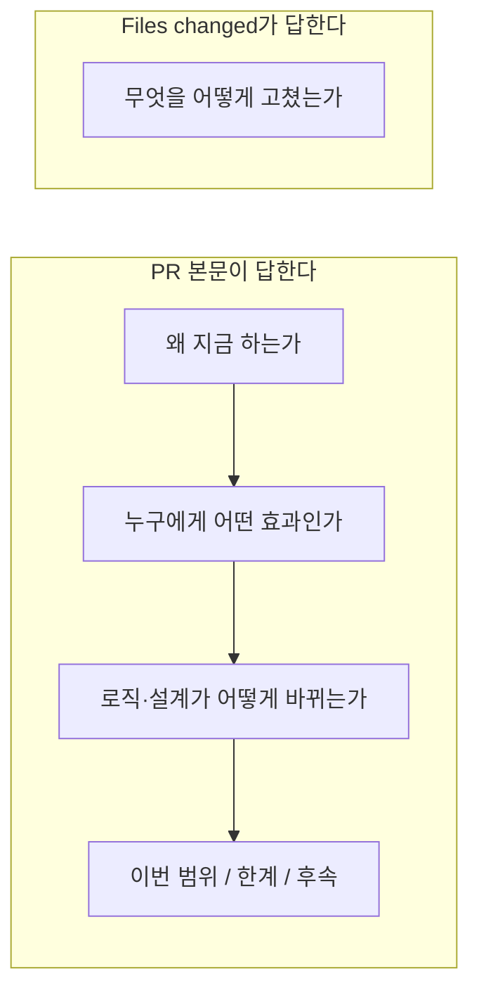
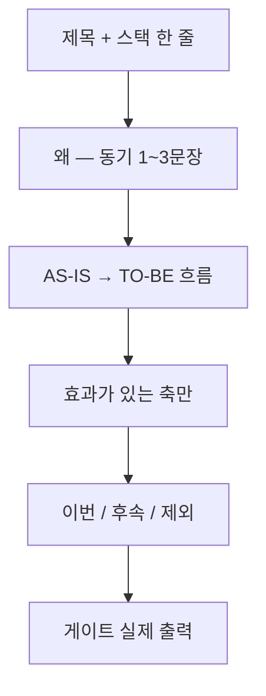
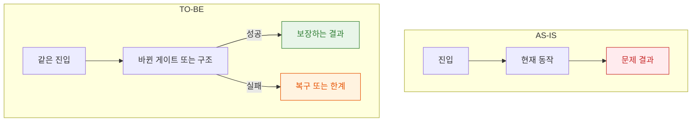
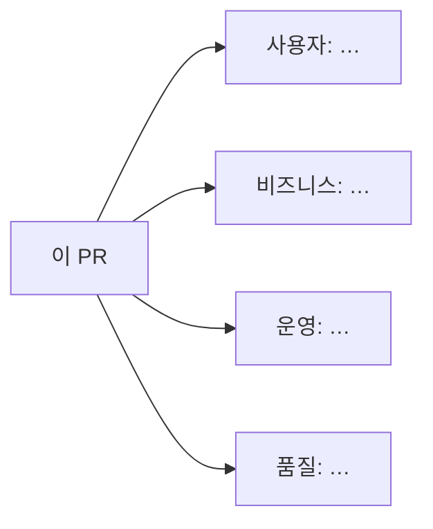
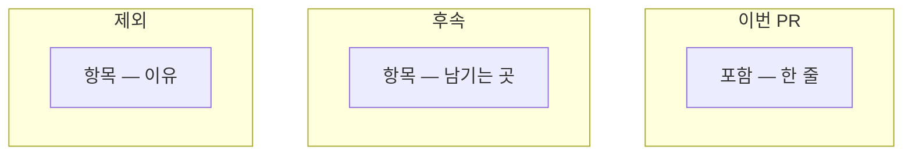
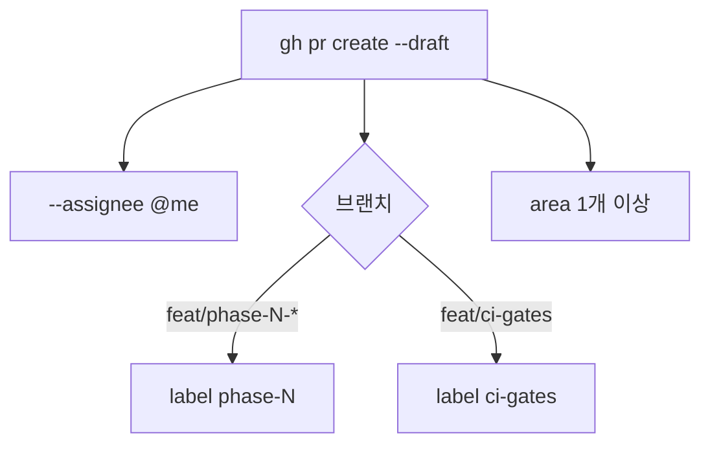
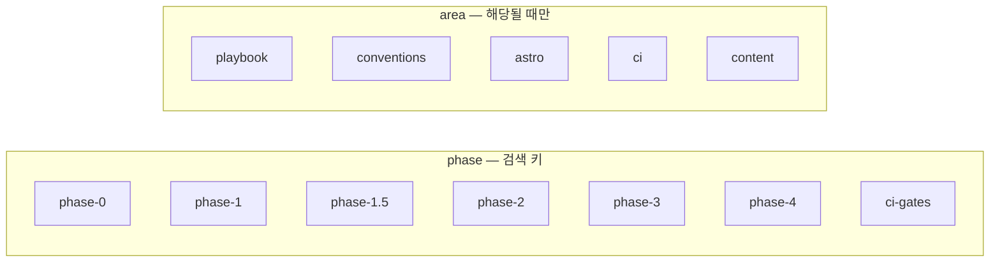

# PR 작성 규칙

> 사람(리뷰어)이 **사전 맥락 없이** 머지 여부를 판단하는 문서다. 에이전트는 이 파일을 따라 제목·본문을 쓴다.
> 커밋 메시지: [`commits.md`](commits.md). 초안→리뷰→ready: [developer playbook](../../.tasks/playbook/developer.md).

본문은 **한국어**. 모호한 수식어(`개선`, `리팩터`, `정리`)만으로 끝내지 않는다. 효과·한계를 한 문장으로 말할 수 없으면 아직 쓸 준비가 아니다.

## 본문이 답하는 것

Files changed가 이미 보여주는 것(파일 목록, 줄 단위 디프)은 본문에 반복하지 않는다.



효과는 해당되는 축만 그린다. 없는 축을 억지로 채우지 않는다.

- **사용자** — 방문자가 보거나 못 보게 되는 것
- **비즈니스** — 검색·공개 범위·이력 신뢰 등, 사이트 목적에 닿는 것 (해당될 때만)
- **운영** — 배포, CI, 롤백, 관측
- **품질** — 테스트가 고정하는 불변식, 삭제된 우회

## 제목

`<type>(<scope>): <효과가 드러나는 한국어 한 줄>`

- `type`/`scope`는 [`commits.md`](commits.md)와 같다.
- **결과**를 앞에 둔다. 내부 수단만 적지 않는다.
- 스택이면 페이즈를 scope에 넣는다: `feat(phase-1): …`

```text
# 좋음 — 왜 / 무엇이 달라지는지
feat(phase-1): 정적 페이지를 Astro로 옮겨 Pages 배포를 Actions로 고정한다

# 나쁨 — 파일 나열, 효과 없음
feat: astro 추가 및 컴포넌트 작성
```

## 본문 구성

위가 1–2분에 읽히게 한다. 줄글은 다이어그램 **캡션**(각 블록 1–3문장)만. 표는 쓰지 않는다. 해당 없는 절은 삭제한다.



구조·호출이 바뀌면 흐름도(`flowchart`)에 **시퀀스**를 추가한다. 결정 게이트가 늘면 `{}` 노드로 그린다.

### AS-IS / TO-BE

실패·성공·저하 노드는 색을 고정한다. 라벨은 반드시 따옴표.

- 실패: `fill:#ffebee,stroke:#c62828,color:#c62828`
- 성공: `fill:#e8f5e9,stroke:#2e7d32,color:#2e7d32`
- 저하·후속: `fill:#fff3e0,stroke:#e65100,color:#e65100`

### 범위

후속이 있으면 **어디에 남기는지**를 노드에 쓴다 (`phase-2 PLAN`, `#이슈`). `나중에`만 적지 않는다. 제외는 **이유**를 붙인다.

### 검증

`bun run check` · `bunx oxfmt --check .` · `bunx oxlint .` · `bunx vitest run`을 **이 브랜치 HEAD에서 다시 실행**한 출력만 붙인다. 이전 초안에서 숫자를 복사하지 않는다. 측정하지 않은 비율(`100%`, `대폭`)은 쓰지 않는다.

## 템플릿

해당 없는 subgraph·절은 지운다. `gh pr create --draft --body-file`로 붙인다.

````markdown
> **스택**: base `feat/<parent>` ← head `feat/<this>` — 아래 페이즈가 먼저 머지돼야 이 디프가 맞다.

## 왜

<!-- 지금 하지 않으면 무엇이 막히거나 깨지는지. 디프 요약 금지. -->

## 흐름



## 효과



## 범위



## 검증

```
$ bun run check
→ (이 HEAD의 실제 출력)

$ bunx oxfmt --check .
→ …

$ bunx oxlint .
→ …

$ bunx vitest run
→ …
```
````

호출 순서가 핵심이면 `## 흐름` 아래에 `sequenceDiagram`을 하나 더 둔다. `alt`/`else`로 성공·실패를 나눈다. 메시지 텍스트에 `|`를 쓰지 않는다.

## 다이어그램 문법

GitHub에서 파싱 실패하면 본문이 빈 상자가 된다.

- 노드 라벨은 `A["텍스트"]`. 괄호, `#`, `:`, `/`는 따옴표 안에만.
- 라벨 줄바꿈은 `<br/>`.
- 저장/대기: `[("…")]`. 분기: `{"…"}`.
- 게시 전 렌더(프리뷰 또는 mermaid parse). 깨진 채로 올리지 않는다.

## Assignee와 라벨

PR은 본문만으로 검색하지 않는다. 생성 시 **assignee와 라벨을 같이** 붙인다. 빠진 채로 올리지 않는다.



- Assignee: GitHub UI는 `gitgitWi`. `gh`는 `--assignee @me`. 다른 사람·봇을 넣지 않는다.
- 라벨은 아래 **닫힌 집합**만. 없으면 `gh label create` 후 붙인다. 한 번 쓰는 임의 이름은 만들지 않는다.
- 페이즈 작업이면 `phase-N` 또는 `ci-gates`를 **반드시** 하나. area는 해당되는 것만.



의미 (slug 그대로 `gh pr list --label <slug> --state all`):

- `phase-0` — Foundation: `main`, bun, 스킬, StyleX 스파이크
- `phase-1` — Scaffold: Astro, StyleX DS, Pages
- `phase-1.5` — Visual: design.md, Prism Vitesse Light, Home/목업 레이아웃
- `phase-2` — Content: collections, MDX, wiki
- `phase-3` — Wiki quiz
- `phase-4` — Hardening: Pagefind, SEO, leak-guard
- `ci-gates` — bun check/format/lint/test 워크플로 스택
- `playbook` — 역할, 하니스, 스폰
- `conventions` — 커밋·PR·코드 스타일
- `astro` — Astro, StyleX, Pages
- `ci` — Actions, 게이트, lockfile
- `content` — articles, til, MDX, visibility

이미 있는 GitHub 라벨(`documentation`, `bug`, `Posts` …)은 맞을 때만 추가한다. 위 slug를 대체하지 않는다.

## 생성·갱신

```bash
gh pr create --draft --base <parent> --assignee @me \
  --label phase-N --label <area> \
  --title "<제목>" --body-file /tmp/pr-body.md
# 리뷰 중 커밋이 본문을 낡게 만들면
gh pr edit <N> --body-file /tmp/pr-body.md
# 라벨이 없으면 먼저 생성 (description은 이 문서의 의미 한 줄)
gh label create <slug> --description "<의미>" --color "1d76db"
# REVIEW APPROVE 뒤에만
gh pr ready <N>
```

기존 본문을 고칠 때 `Closes #…`와 스택 경고(`> **스택**`)를 지우지 않는다.
